# 基于进迭时空 K1 的“小蝶”端侧儿童语音大模型系统

“小蝶”是一套部署在进迭时空 K1 MUSE Pi Pro 板卡上的端侧 AI 儿童语音故事系统。它面向 3 至 7 岁学龄前儿童，通过实体按钮触发语音输入，在本地完成 ASR 语音识别、RAG 知识增强、LLM 故事生成、TTS 语音合成和 Qt6 图形界面展示。

系统目标是做一台不依赖云端、保护儿童语音隐私、可以实时生成个性化故事的智能故事机。所有核心推理都运行在 K1 本地设备上，语音数据和交互内容不需要离开设备。


## 项目亮点

- 全链路端侧 AI：ASR、RAG、1.5B LLM、TTS 均在 K1 本地运行。
- 国产 RISC-V 平台部署：基于 K1 MUSE Pi Pro 和 Bianbu Linux Lxqt。
- 儿童故事生成：使用 Qwen2.5-1.5B-Instruct 微调模型生成中文儿童故事。
- 轻量 RAG 知识增强：使用 BM25 检索 156 张动画 IP 知识卡片，注入角色设定和安全约束。
- 句子级流式 TTS：LLM 每生成一组完整中文句子，就立即送入 TTS 合成并播放，缩短儿童感知等待时间。
- 常驻守护进程：ASR 与 TTS 模型启动时加载一次，后续请求复用模型实例。
- 隐私友好：语音识别、故事生成和语音合成都在本地完成。

## 交互流程

儿童只需要按住实体按钮，说出想听的故事主题，松开按钮后系统自动完成以下流程：

1. GPIO 按钮触发录音。
2. USB 麦克风采集 16 kHz 单声道音频。
3. sherpa-onnx Zipformer int8 ASR 守护进程完成离线中文语音识别。
4. BM25 检索本地动画 IP 知识库，匹配角色设定和安全约束。
5. Qwen2.5-1.5B-Instruct LoRA 微调模型通过 Ollama 流式生成故事文本。
6. 句子分段器将文本按完整中文句子切分。
7. Chaowen Full TTS 守护进程逐段合成语音。
8. ffmpeg 转码后通过板载音频输出播放。
9. Qt6 原生界面同步显示状态和故事文字。

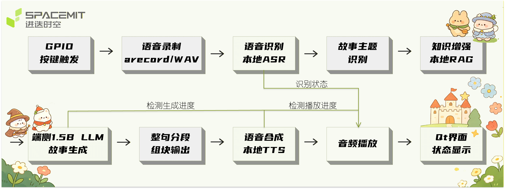

## 硬件系统

小蝶硬件原型以 K1 MUSE Pi Pro 为核心，外接 USB 麦克风、实体按钮、音频输出设备，并配合 3D 打印外壳完成故事机形态验证。

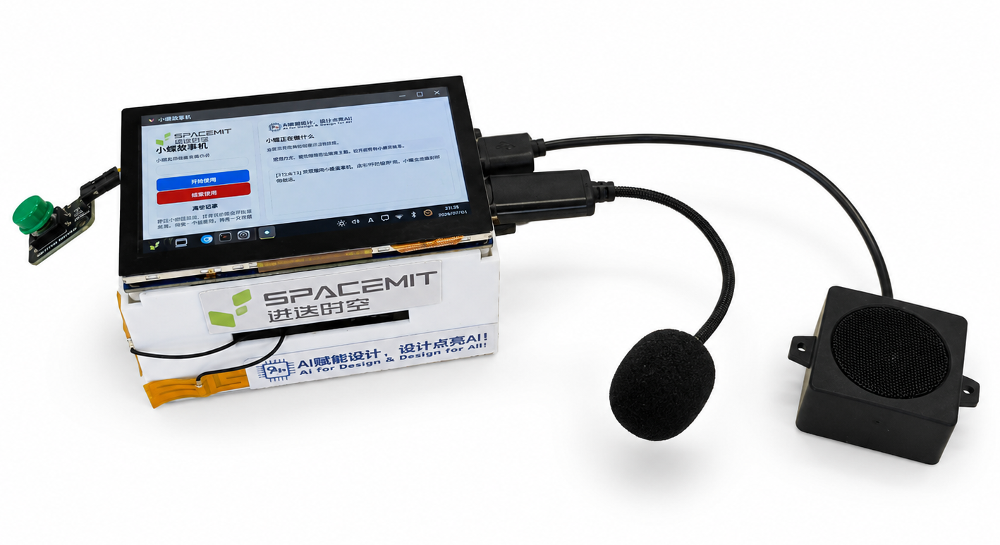

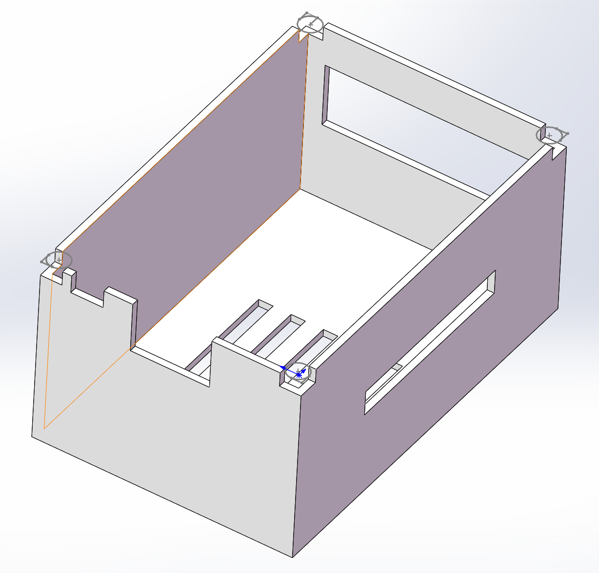

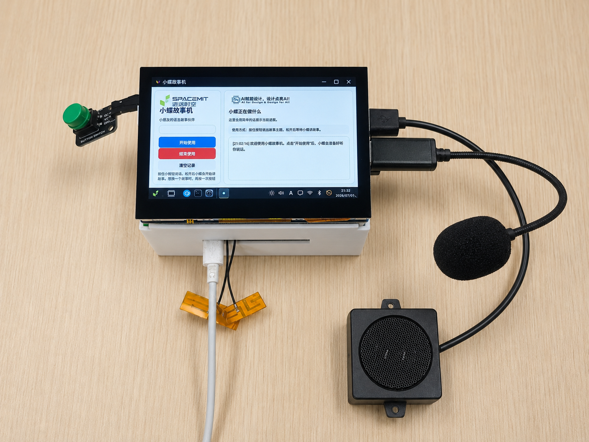

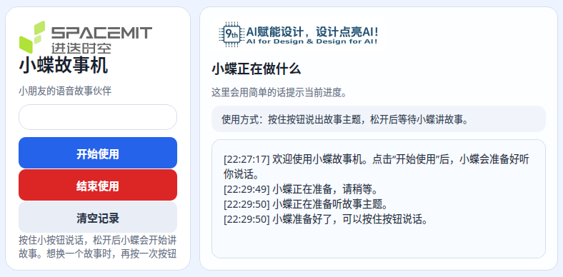

## 软件架构

系统软件按运行时职责拆分为五层：

| 层级 | 模块 | 说明 |
| --- | --- | --- |
| 交互层 | Qt6 GUI、GPIO 按钮 | 显示儿童友好的状态提示，接收按键触发 |
| 语音输入 | 录音脚本、ASR daemon | 采集音频并转写为中文文本 |
| 知识增强 | BM25 RAG | 从本地 IP 知识卡片检索角色和安全设定 |
| 故事生成 | Ollama、Qwen2.5-1.5B LoRA GGUF | 流式生成儿童故事 |
| 语音输出 | TTS daemon、ffmpeg、aplay | 逐段合成并播放语音 |

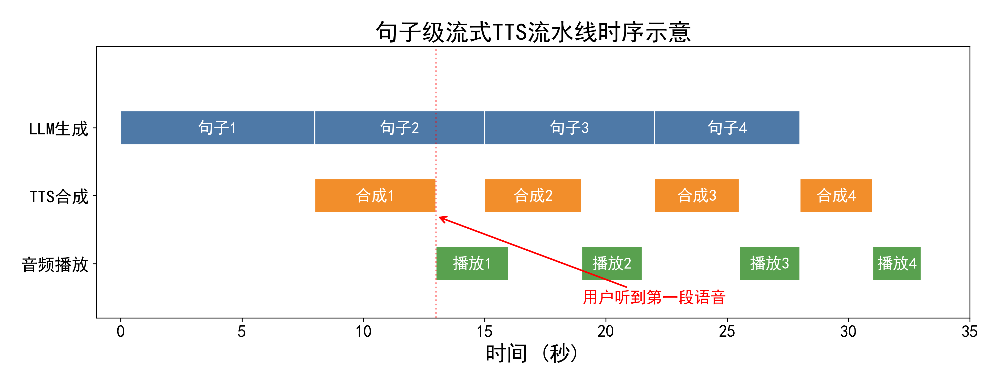

## 训练与数据

训练阶段使用开放许可儿童故事数据构建中文 SFT 数据集，并针对儿童故事生成任务进行 LoRA 微调。

| 项目 | 数值 |
| --- | --- |
| 原始开放数据 | 约 7,237 条 |
| 清洗后故事样本 | 5,455 条 |
| SFT 训练样本 | 5,180 条 |
| 基座模型 | Qwen2.5-1.5B-Instruct |
| 微调方式 | LoRA |
| 训练步数 | 2,000 steps |
| 最佳 eval loss | 1.882 |
| 部署格式 | GGUF Q4_K_M |
| 最终模型体积 | 约 986 MB |

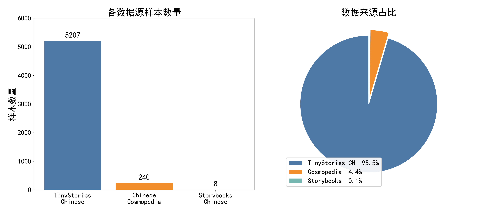

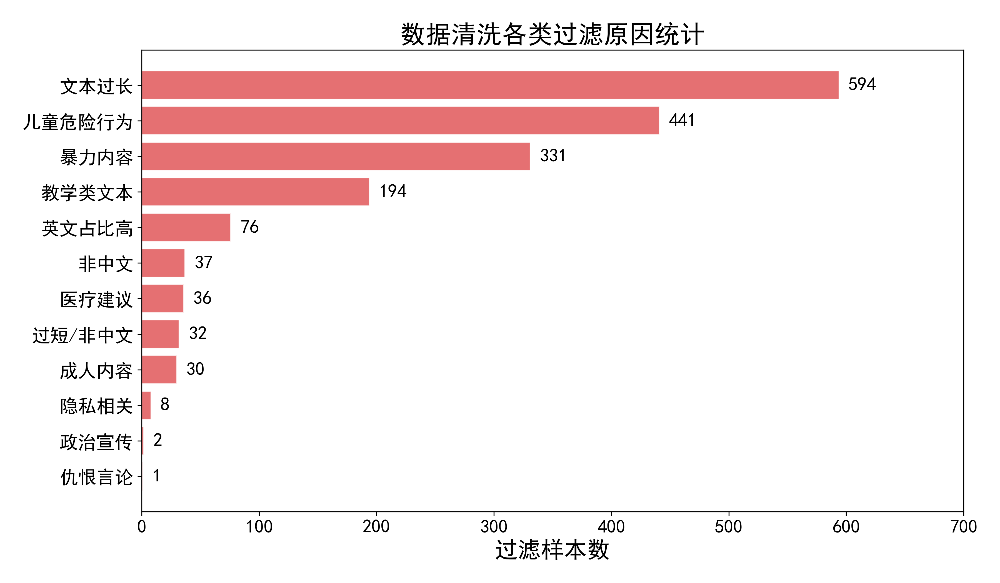

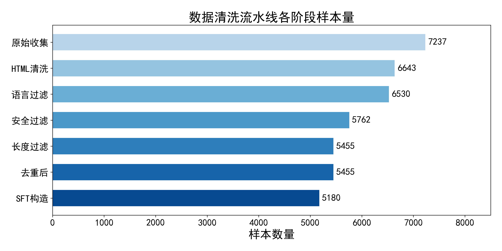

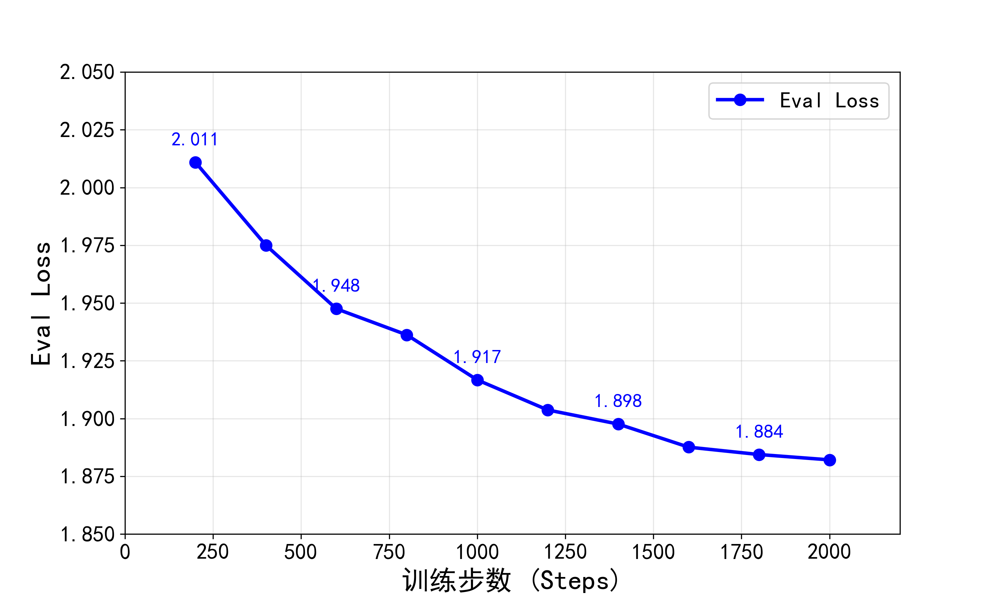

## RAG 知识库

系统没有额外运行 embedding 模型，而是采用 BM25 文本检索来降低 K1 端侧计算负担。知识库包含 156 张动画 IP 知识卡片，覆盖小猪佩奇、汪汪队立大功、海底小纵队、巴巴爸爸、小马宝莉等儿童熟悉角色。

知识卡片包含：

- 角色关系
- 中英文别名
- 故事背景
- 安全约束
- 可用故事设定

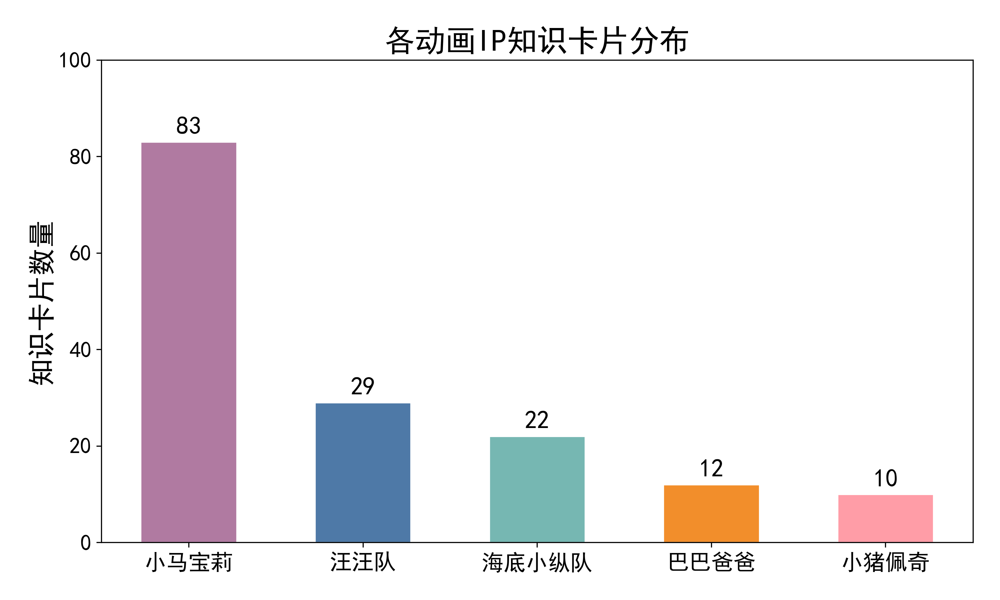

## 性能指标

以下指标来自 K1 MUSE Pi Pro 板卡实测：

| 指标 | 实测结果 |
| --- | --- |
| LLM 模型体积 | 约 986 MB |
| 纯 LLM 首 token 延迟 | 2.88 至 2.98 s |
| 纯 LLM 生成速度 | 3.34 至 3.38 tokens/s |
| RAG 缓存命中首 token 延迟 | 约 4.81 s |
| 全链路并发首 token 延迟 | 5.34 至 5.74 s |
| 全链路并发生成速度 | 1.64 至 1.67 tokens/s |
| TTS 首段音频延迟 | 2.38 至 4.70 s |
| TTS 实时率 | 1.77 至 1.84 |
| ASR 首次加载时间 | 约 27 至 28 s |
| RAG 知识卡片数 | 156 |

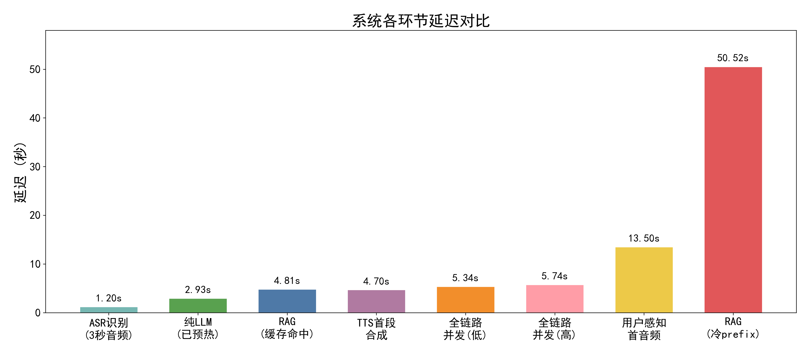

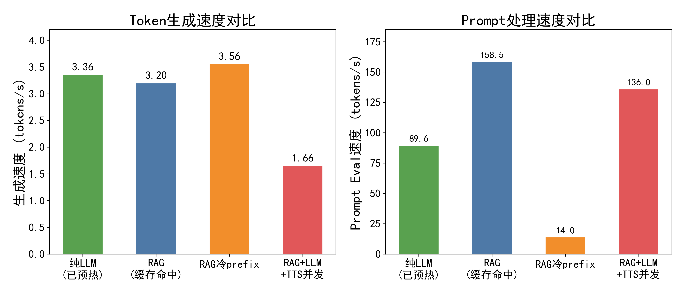

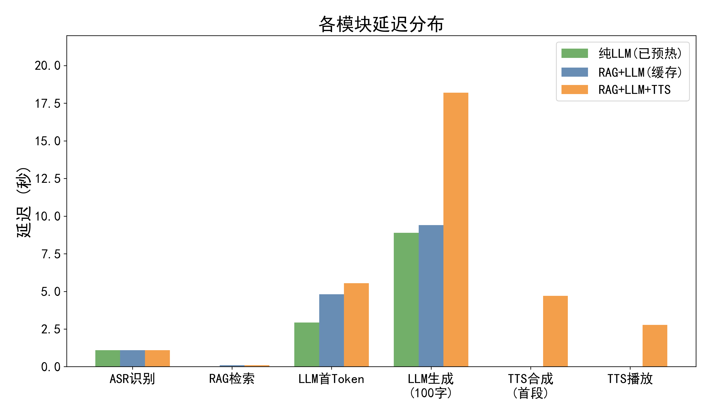

## 演示场景

小蝶已在线下幼儿园场景中进行演示，验证儿童语音输入、故事生成、语音播报和班级互动流程。

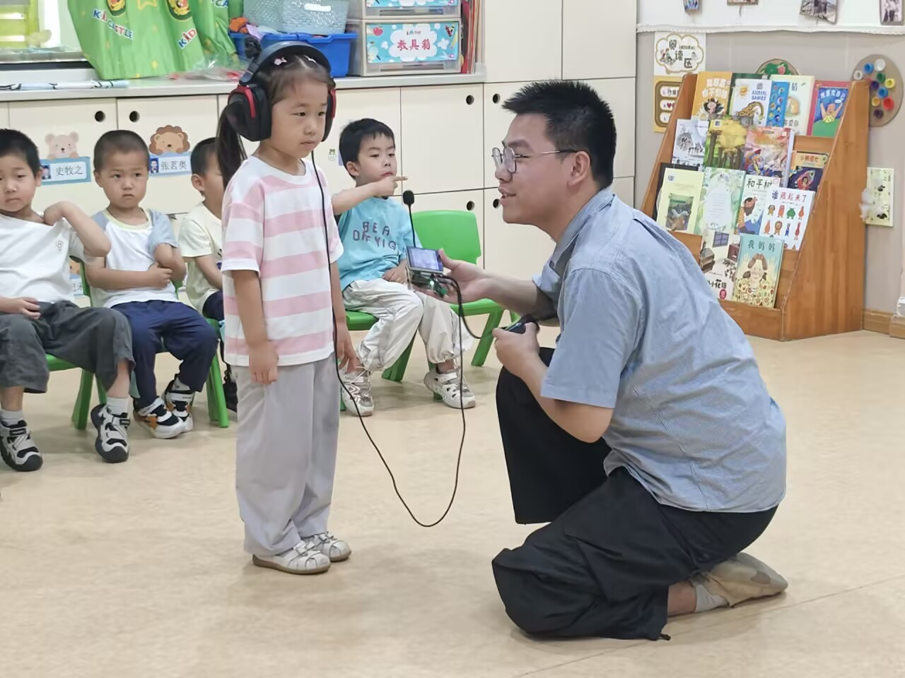

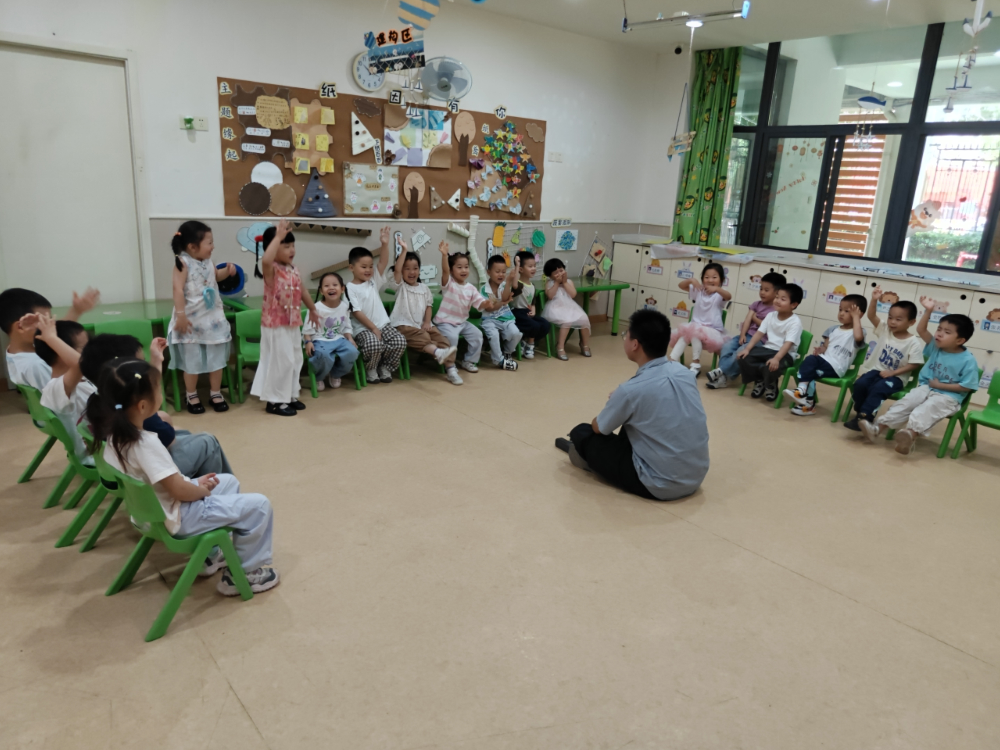

## 主要创新点

1. 在 K1 RISC-V CPU 上实现 ASR、RAG、1.5B LLM 和 TTS 的端侧全链路部署。
2. 使用句子级流式 TTS，将 LLM 生成、TTS 合成和音频播放流水线化。
3. 使用轻量 BM25 RAG 替代 embedding 检索，降低端侧资源占用。
4. 使用 ASR 与 TTS 常驻 daemon，避免每次交互重复加载模型。
5. 面向儿童故事生成构建开放许可数据清洗、SFT 训练、LoRA 微调和 GGUF 量化部署流程。

## 仓库结构

```text
.
├── source/XiaoDie/          # 主工程源码：板端应用、Qt 界面、ASR/TTS/LLM 调度和部署脚本
├── training/Duanwu/         # 第二轮训练工程：数据清洗、RAG 知识库、训练配置和评估报告
├── demos/                   # K1 板端导出的故事音频和文本样例
├── docs/report/images/      # GitHub 首页 README 使用的报告图片
├── README_PACKAGE.md        # 项目交付说明
└── IMPORTANT_HASHES.sha256  # 关键模型与交付资产哈希
```

## 快速入口

训练环境检查：

```powershell
cd source\XiaoDie
.\scripts\env.ps1
python scripts\check_env.py
```

板端故事应用入口：

```bash
cd /home/vicky/xiaodie
sudo env XIAODIE_BUTTON_GPIO=35 XIAODIE_BUTTON_ACTIVE=low /home/vicky/xiaodie/app/start_xiaodie_button_story.sh
```

RAG 文本测试入口：

```powershell
cd training\Duanwu
.\scripts\env.ps1
python .\scripts\rag_generate_story.py --adapter outputs\best_story_adapter_qwen2_5_1_5b --franchise peppa_pig --query "小猪佩奇和乔治一起分享玩具" --age "4-6岁" --style "睡前安抚" --target-chars 700
```
