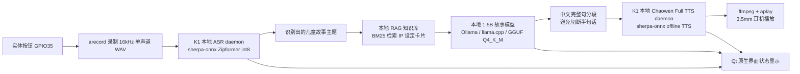

# 小蝶故事机技术上下文说明

本文是给另一个 AI 助手理解项目技术细节用的材料。重点是说明项目代码在哪里、程序如何实现、端侧 AI 链路如何运行、1.5B 模型如何训练和优化、ASR/TTS/按钮/Qt 前端如何接入，以及目前已经测到的关键指标。

## 1. 项目一句话说明

小蝶故事机是部署在进迭时空 K1 MUSE Pi Pro 板卡上的儿童语音故事助手。小朋友长按实体按钮说出故事主题，松开按钮后，板卡录音并进行语音识别，再由端侧故事生成模型或备用 API 链路生成儿童故事，最后由板卡本地 Chaowen Full TTS 合成中文语音并通过 3.5mm 耳机口播放。

比赛重点是端侧 AI，所以技术说明里的主线应以 K1 本地离线链路为准：

```text
按钮输入 -> USB 麦克风录音 -> K1 本地 ASR -> K1 本地 RAG -> K1 本地 1.5B LLM -> K1 本地 Chaowen Full TTS -> 3.5mm 耳机输出
```

另有一条 DeepSeek API 链路，用于快速生成高质量故事并验证前后端交互、TTS 分段播放、按钮打断等工程逻辑。API 链路不是端侧 AI 性能指标主线，报告里如果强调端侧能力，应把本地 1.5B 模型链路作为核心。

## 2. 机器和目录

### 2.1 台式机训练环境

- 系统：Windows
- 工作目录：`D:\Spacemit\XiaoDie`
- 第二轮训练目录：`E:\Duanwu`
- Python 环境：`E:\xiaodie_envs\xiaodie-qwenasr\Scripts\python.exe`
- GPU：NVIDIA GeForce RTX 4060 Ti
- 作用：收集合法数据集、清洗、构造 SFT 样本、训练 LoRA/QLoRA、合并 LoRA、导出 GGUF、量化模型、通过 SSH 部署到 K1。

### 2.2 K1 板卡环境

- 板卡：进迭时空 K1 MUSE Pi Pro
- 系统：Bianbu Linux
- 架构：riscv64
- 用户：`vicky`
- 应用根目录：`/home/vicky/xiaodie`
- 主要外设：
  - USB 麦克风：用于录音输入。
  - 3.5mm 耳机口：用于语音输出。
  - GPIO 35 按钮：用于长按录音、松开识别、再次按下打断当前任务。

## 3. 总体架构



核心设计点：

- ASR 和 TTS 都是常驻 daemon，避免每次交互重复加载模型。
- LLM 支持端侧本地 1.5B 模型链路，也支持 DeepSeek API 备用链路。
- TTS 不等待全文生成，而是按 2 到 4 个完整中文句子组成一个 chunk，提前合成并排队播放。
- Qt 前端只显示用户能理解的状态，例如“正在听”“正在识别”“正在想故事”“准备声音”“讲故事中”，不显示 ASR/GPIO/模型名称等技术词。
- 再次按下按钮时，当前录音、ASR、LLM、TTS 都会被打断并重新开始。

## 4. 代码和文件位置

### 4.1 训练工程

训练工程在 `E:\Duanwu`：

| 类型 | 路径 | 作用 |
|---|---|---|
| 数据配置 | `E:\Duanwu\configs\datasets.yaml` | 合法数据源配置 |
| 训练配置 | `E:\Duanwu\configs\train.yaml` | Qwen3-4B 训练配置 |
| 1.5B 训练配置 | `D:\Spacemit\XiaoDie\configs\train_qwen2_5_1_5b.yaml` | Qwen2.5-1.5B-Instruct 训练配置 |
| 数据收集 | `E:\Duanwu\scripts\collect_open_data.py` | 收集 TinyStories Chinese、Chinese Cosmopedia、Storybooks Chinese 等开放数据 |
| 数据清洗 | `E:\Duanwu\scripts\clean_filter_dedupe.py` | HTML/乱码/危险内容/非中文/近重复过滤 |
| SFT 构造 | `E:\Duanwu\scripts\build_sft.py` | 构造 instruction tuning 格式 |
| 训练脚本 | `E:\Duanwu\scripts\train_round2_lora.py` | Transformers + PEFT + bitsandbytes QLoRA/LoRA 训练 |
| checkpoint 选择 | `E:\Duanwu\scripts\select_best_checkpoint.py` | 根据 eval loss 选择最佳 checkpoint |
| RAG 知识库构造 | `E:\Duanwu\scripts\build_ip_rag_kb.py` | 构造动画 IP 知识卡片和 BM25 索引 |
| IP 增强 SFT | `E:\Duanwu\scripts\build_ip_augmented_sft.py` | 生成少量 IP/RAG 风格增强样本 |

### 4.2 1.5B 模型产物

| 类型 | 路径 | 说明 |
|---|---|---|
| 基座模型 | `E:\Duanwu\models\Qwen2.5-1.5B-Instruct` | 1.5B 中文指令模型基座 |
| LoRA adapter | `E:\Duanwu\outputs\qwen2_5-1_5b-story-round3` | 完整训练输出 |
| 最佳 adapter | `E:\Duanwu\outputs\best_story_adapter_qwen2_5_1_5b` | 选择后的最佳 checkpoint |
| 合并 FP16 HF 模型 | `D:\Spacemit\XiaoDie\deploy_artifacts\models\qwen2_5-1_5b-xiaodie-story-merged-fp16` | LoRA 合并后的 Hugging Face 模型 |
| F16 GGUF | `D:\Spacemit\XiaoDie\deploy_artifacts\gguf\qwen2_5-1_5b-xiaodie-story-f16.gguf` | 约 3.09GB |
| Q4_K_M GGUF | `D:\Spacemit\XiaoDie\deploy_artifacts\gguf\qwen2_5-1_5b-xiaodie-story-Q4_K_M.gguf` | 约 986MB，K1 端实际部署模型 |

4B 模型也训练并导出了 GGUF，但 K1 端实际运行更适合 1.5B：

| 类型 | 路径 | 大小 |
|---|---|---:|
| Qwen3-4B F16 GGUF | `D:\Spacemit\XiaoDie\deploy_artifacts\gguf\qwen3-4b-xiaodie-story-f16.gguf` | 约 8.05GB |
| Qwen3-4B Q4_K_M GGUF | `D:\Spacemit\XiaoDie\deploy_artifacts\gguf\qwen3-4b-xiaodie-story-Q4_K_M.gguf` | 约 2.50GB |
| Qwen3-4B Q5_K_M GGUF | `D:\Spacemit\XiaoDie\deploy_artifacts\gguf\qwen3-4b-xiaodie-story-Q5_K_M.gguf` | 约 2.89GB |

### 4.3 K1 部署工程

本地部署代码在 `D:\Spacemit\XiaoDie\deploy`，板卡对应目录在 `/home/vicky/xiaodie`。

| 模块 | 本地路径 | K1 路径 | 作用 |
|---|---|---|---|
| LLM/RAG | `deploy\k1_llm` | `/home/vicky/xiaodie/llm` | Ollama 调用、本地 RAG、DeepSeek API 备用链路、性能测试 |
| ASR | `deploy\k1_asr` | `/home/vicky/xiaodie/asr` | sherpa-onnx ASR C daemon |
| TTS | `deploy\k1_tts` | `/home/vicky/xiaodie/tts` | Chaowen Full TTS C daemon、FIFO 服务 |
| App | `deploy\k1_app` | `/home/vicky/xiaodie/app` | 按钮控制逻辑、Qt 原生界面、桌面启动项 |
| 模型 | `deploy_artifacts\gguf` | `/home/vicky/xiaodie/models` | GGUF 量化模型 |
| RAG 数据 | `E:\Duanwu\data\ip_rag` | `/home/vicky/xiaodie/rag` | IP 知识卡片和检索索引 |

## 5. 数据集和合规处理

第二轮训练使用了明确许可的数据源，不使用盗版小说站、商业童话站、版权不明出版物站。

### 5.1 数据源

| 数据源 | URL | License | 用途 |
|---|---|---|---|
| TinyStories Chinese | `https://huggingface.co/datasets/adam89/TinyStoriesChinese` | CDLA-Sharing-1.0 | 主体儿童短故事语料 |
| Chinese Cosmopedia | `https://huggingface.co/datasets/opencsg/chinese-cosmopedia` | Apache-2.0 | 筛选出中文叙事/常识类文本 |
| Storybooks Chinese | `https://github.com/global-asp/storybooks-chinese` | MIT | 开放儿童故事文本 |
| Project Gutenberg public domain | 公有领域文本 | public-domain | 存档追踪；非中文内容默认不进入主训练集 |
| xiaodie_safety_seed | 本地生成 | project-generated | 安全/风格补充，默认不作为主数据 |

数据报告位置：

- `E:\Duanwu\reports\license_report.md`
- `E:\Duanwu\reports\data_stats.md`
- `E:\Duanwu\reports\sft_build_report.md`

### 5.2 清洗和过滤规则

清洗脚本：`E:\Duanwu\scripts\clean_filter_dedupe.py`

主要处理：

- 删除 HTML 标签、脚本、样式、URL、Markdown 标题、重复标点。
- 过滤中文字符过少、中文比例过低、英文词过多的样本。
- 过滤非故事类教学文本，例如“课程单元”“教学目标”“定义与内涵”等。
- 过滤成人、暴力、仇恨、政治宣传、医疗建议、隐私、危险儿童行为等内容。
- 使用中文字符 shingle 做近重复去重。
- 给每条样本计算 `quality_score`。

第二轮数据统计：

| 指标 | 数值 |
|---|---:|
| 清洗后保留样本 | 5455 |
| 最终样本 | 5455 |
| 中文总字符数 | 1,349,058 |
| 平均中文字符数 | 247.3 |
| 高质量比例 | 0.053 |
| SFT 样本总数 | 5180 |
| train 样本 | 4973 |
| eval 样本 | 207 |

来源分布：

| 来源 | 样本数 |
|---|---:|
| TinyStories Chinese | 5207 |
| Chinese Cosmopedia | 240 |
| Storybooks Chinese | 8 |

主要过滤原因：

| 原因 | 数量 |
|---|---:|
| too_long | 594 |
| unsafe_child | 441 |
| unsafe_violence | 331 |
| non_story_instructional_text | 194 |
| too_much_english | 76 |
| non_chinese_main_text | 37 |
| unsafe_medical | 36 |
| too_short_or_not_chinese | 32 |
| unsafe_adult | 30 |
| unsafe_privacy | 8 |
| unsafe_politics | 2 |
| unsafe_hate | 1 |

## 6. RAG 知识增强

RAG 用于解决儿童常见动画 IP 设定不准确的问题，例如小猪佩奇、巴巴爸爸、汪汪队、海底小纵队、小马宝莉。RAG 不直接让模型背诵长文本，而是把角色关系、别名、安全策略和可用设定做成短知识卡片，生成时检索相关卡片并注入 prompt。

RAG 产物：

- 知识卡片：`E:\Duanwu\data\ip_rag\ip_knowledge_cards.jsonl`
- BM25 索引：`E:\Duanwu\data\ip_rag\ip_rag_index.json`
- K1 部署位置：`/home/vicky/xiaodie/rag/ip_knowledge_cards.jsonl` 和 `/home/vicky/xiaodie/rag/ip_rag_index.json`

RAG KB 统计：

| 指标 | 数值 |
|---|---:|
| 知识卡片总数 | 156 |
| IP 增强 SFT 样本 | 146 |

IP 分布：

| IP | 卡片数 |
|---|---:|
| My Little Pony / 小马宝莉 | 83 |
| Paw Patrol / 汪汪队 | 29 |
| Octonauts / 海底小纵队 | 22 |
| Barbapapa / 巴巴爸爸 | 12 |
| Peppa Pig / 小猪佩奇 | 10 |

RAG 检索脚本：

- 本地端侧链路：`D:\Spacemit\XiaoDie\deploy\k1_llm\xiaodie_rag_ollama_stream.py`
- API 备用链路：`D:\Spacemit\XiaoDie\deploy\k1_llm\xiaodie_deepseek_tts_stream.py`

RAG 实现要点：

- 使用轻量 BM25，不依赖大 embedding 模型，适合 K1 端部署。
- `tokens()` 会同时提取英文词、中文单字和中文 bigram，提高中英文别名匹配。
- `retrieve()` 会按 franchise 过滤，并强制加入 `curated_fact`、`safety_policy`、`alias_policy` 类型卡片。
- `build_prompt()` 明确要求“只能使用知识卡片中出现的人物、地点、关系和设定；不要编造官方设定”。
- 对“整理、分享、轮流、合作”等儿童日常主题设了强约束，避免模型跑到怪物战斗、危险冒险、武器等方向。

## 7. 1.5B 模型训练和优化

### 7.1 为什么从 4B 切换到 1.5B

4B 模型在台式机上可以训练，生成质量更好，但在 K1 端推理时内存、加载时间、首 token 延迟和与 TTS 并发运行的压力都明显更高。比赛要求端侧 AI 能够实际运行，因此最终端侧链路选择 Qwen2.5-1.5B-Instruct 作为基座，再用同一批儿童故事数据进行 LoRA/QLoRA 微调，并量化为 Q4_K_M GGUF。

4B 模型仍保留为质量对照和上限参考；端侧演示以 1.5B 为主。

### 7.2 训练配置

1.5B 配置文件：`D:\Spacemit\XiaoDie\configs\train_qwen2_5_1_5b.yaml`

关键参数：

| 项目 | 值 |
|---|---|
| base_model | `E:/Duanwu/models/Qwen2.5-1.5B-Instruct` |
| adapter_output | `E:/Duanwu/outputs/qwen2_5-1_5b-story-round3` |
| best_adapter_output | `E:/Duanwu/outputs/best_story_adapter_qwen2_5_1_5b` |
| train_file | `E:/Duanwu/data/processed/sft_train.jsonl` |
| eval_file | `E:/Duanwu/data/processed/sft_eval.jsonl` |
| max_seq_length | 256 |
| max_steps | 2000 |
| learning_rate | 0.00012 |
| batch_size | 1 |
| gradient_accumulation_steps | 1 |
| warmup_ratio | 0.03 |
| save_steps | 200 |
| eval_steps | 200 |
| fp16 | true |
| LoRA r | 16 |
| LoRA alpha | 32 |
| LoRA dropout | 0.05 |
| target_modules | `q_proj`, `k_proj`, `v_proj`, `o_proj` |

训练脚本：`E:\Duanwu\scripts\train_round2_lora.py`

训练技术点：

- 使用 Hugging Face Transformers `AutoModelForCausalLM`。
- 使用 PEFT LoRA。
- 使用 bitsandbytes 4bit NF4 量化加载基座模型，降低 4060 Ti 显存压力。
- 使用 `prepare_model_for_kbit_training`。
- 使用 assistant-only loss：system/user prompt 部分 label 置为 `-100`，只训练 assistant 回答。
- 使用 tokenizer 的 chat template；如果模型不支持则退回自定义模板。
- `PYTORCH_CUDA_ALLOC_CONF=expandable_segments:True` 用于缓解显存碎片。

训练命令：

```powershell
cd D:\Spacemit\XiaoDie
. E:\Duanwu\scripts\env.ps1
python -u E:\Duanwu\scripts\train_round2_lora.py --config D:\Spacemit\XiaoDie\configs\train_qwen2_5_1_5b.yaml
python E:\Duanwu\scripts\select_best_checkpoint.py --config D:\Spacemit\XiaoDie\configs\train_qwen2_5_1_5b.yaml
```

### 7.3 训练结果

训练摘要文件：`D:\Spacemit\XiaoDie\reports\qwen2_5_1_5b_training_summary.md`

| 指标 | 数值 |
|---|---:|
| 训练步数 | 2000 |
| 最佳 checkpoint | `checkpoint-2000` |
| 最佳 eval loss | 1.882116436958313 |
| train_runtime | 571.2752 秒 |
| train_samples_per_second | 3.501 |
| train_steps_per_second | 3.501 |
| train_loss | 1.9474549961090089 |
| epoch | 0.4 |

eval loss 变化：

| step | eval_loss |
|---:|---:|
| 200 | 2.0108799934387207 |
| 400 | 1.97504460811615 |
| 600 | 1.947502851486206 |
| 800 | 1.9361850023269653 |
| 1000 | 1.9166946411132812 |
| 1200 | 1.9036979675292969 |
| 1400 | 1.8976128101348877 |
| 1600 | 1.8875514268875122 |
| 1800 | 1.884445309638977 |
| 2000 | 1.882116436958313 |

### 7.4 合并和量化

LoRA 合并元数据：

```json
{
  "base_model": "E:\\Duanwu\\models\\Qwen2.5-1.5B-Instruct",
  "adapter": "E:\\Duanwu\\outputs\\best_story_adapter_qwen2_5_1_5b",
  "output": "D:\\Spacemit\\XiaoDie\\deploy_artifacts\\models\\qwen2_5-1_5b-xiaodie-story-merged-fp16",
  "dtype": "float16",
  "format": "huggingface_merged"
}
```

最终 K1 使用：

- 模型文件：`/home/vicky/xiaodie/models/qwen2_5-1_5b-xiaodie-story-Q4_K_M.gguf`
- 运行时模型名：`xiaodie-story-1.5b:latest`
- 运行框架：Ollama / llama.cpp
- Modelfile：`D:\Spacemit\XiaoDie\deploy\k1_llm\Modelfile.xiaodie-story-1.5b`

Modelfile 的主要优化：

- 使用 Q4_K_M 量化 GGUF，模型文件约 986MB。
- `num_ctx 4096`，端侧测试时通常限制到 1024 以降低延迟。
- `temperature 0.18`，降低乱编和发散。
- `top_p 0.72`。
- `repeat_penalty 1.16`，减少重复句式。
- stop token：`<|im_end|>` 和 `<|endoftext|>`。
- system prompt 明确要求儿童安全、只输出故事正文、禁止 emoji 和解释说明、必须遵守 RAG 卡片。

## 8. 端侧 LLM/RAG 推理实现

主要文件：

- `D:\Spacemit\XiaoDie\deploy\k1_llm\xiaodie_rag_ollama_stream.py`
- K1：`/home/vicky/xiaodie/llm/xiaodie_rag_ollama_stream.py`

运行脚本：

- `D:\Spacemit\XiaoDie\deploy\k1_llm\run_xiaodie_story_1_5b_tts.sh`
- K1：`/home/vicky/xiaodie/llm/run_xiaodie_story_1_5b_tts.sh`

本地端侧链路命令示例：

```bash
cd /home/vicky/xiaodie
/home/vicky/xiaodie/llm/run_xiaodie_story_1_5b_tts.sh \
  --franchise peppa_pig \
  --query "佩奇和乔治整理玩具学会分享" \
  --age "4-6岁" \
  --style "睡前安抚" \
  --target-chars 100 \
  --max-new-tokens 96 \
  --ctx-size 1024 \
  --top-k 2 \
  --card-chars 80 \
  --output /home/vicky/xiaodie/reports/perf_e2e_after_runtime.md
```

端侧推理优化：

- Ollama 本地 HTTP streaming 逐 token 返回。
- 只把完整中文句子发送给 TTS FIFO，避免一句话被切成两段语音。
- 对 emoji、ANSI 控制字符、Markdown 符号做归一化过滤。
- 默认只检索少量卡片，例如 `top_k=2`、`card_chars=80`，减少 prompt 长度。
- 通过 `start_xiaodie_runtime.sh` 预热模型和 RAG prefix，显著降低冷启动 TTFT。

预热脚本：

- `D:\Spacemit\XiaoDie\deploy\k1_llm\start_xiaodie_runtime.sh`
- K1：`/home/vicky/xiaodie/llm/start_xiaodie_runtime.sh`

预热做了三件事：

1. 启动 TTS 服务。
2. 调用 Ollama 让 1.5B 模型常驻内存，`keep_alive=60m`。
3. 预热常用 IP 的 RAG prefix，例如 `peppa_pig`。

## 9. ASR 语音识别模块

当前 ASR 是 K1 本地离线推理，不是云端 API。

主要文件：

- 本地源码：`D:\Spacemit\XiaoDie\deploy\k1_asr\xiaodie_asr_daemon.c`
- K1 源码：`/home/vicky/xiaodie/asr/xiaodie_asr_daemon.c`
- K1 二进制：`/home/vicky/xiaodie/asr/bin/xiaodie_asr_daemon`
- 编译脚本：`D:\Spacemit\XiaoDie\deploy\k1_asr\build_asr_daemon.sh`

ASR 模型：

```text
/home/vicky/xiaodie/asr/sherpa-onnx-x-asr-480ms-streaming-zipformer-transducer-zh-en-punct-int8-2026-06-05
```

模型文件：

- `encoder.int8.onnx`
- `decoder.onnx`
- `joiner.int8.onnx`
- `tokens.txt`

ASR 实现：

- 使用 sherpa-onnx C API。
- provider 为 CPU。
- `model_type=zipformer2`。
- `decoding_method=greedy_search`。
- 默认线程数：4。
- 音频输入：16kHz、单声道、S16_LE WAV。
- `tail_pad_ms=500`，用于在录音尾部补静音，提升松开按钮后最后几个字的识别完整度。
- 程序启动后常驻内存，通过 stdin 接收 wav 路径，通过 stdout 输出 JSON。

输出 JSON 形态：

```json
{
  "ok": true,
  "text": "小朋友说出的故事主题",
  "audio_s": 3.2,
  "elapsed_s": 1.1,
  "rtf": 0.34,
  "path": "/home/vicky/xiaodie/records/record_xxx.wav"
}
```

ASR 优化：

- 从“每次识别都加载模型”改成常驻 daemon，避免每次交互 20 秒以上加载时间。
- 按钮服务启动时先加载 ASR daemon，小朋友首次使用前就完成加载。
- 录音结束后修复 `arecord` 被 SIGINT 打断时可能留下的 WAV header 占位长度。
- 识别失败时自动重启 ASR daemon。

已观察到的 ASR 加载情况：

- 首次模型加载约 27 到 28 秒，日志中出现过 `load_s=27.317`、`load_s=28.341`。
- 常驻后再次识别不需要重复加载模型，只处理新录音 WAV。
- 识别耗时随录音长度变化，daemon 会输出 `elapsed_s` 和 `rtf` 供统计。

## 10. Chaowen Full TTS 模块

TTS 是 K1 本地离线推理，使用 sherpa-onnx offline TTS C API 和 Chaowen 声音模型。

主要文件：

- 本地源码：`D:\Spacemit\XiaoDie\deploy\k1_tts\chaowen_tts_daemon.c`
- K1 源码：`/home/vicky/xiaodie/tts/fast/chaowen_tts_daemon.c`
- K1 二进制：`/home/vicky/xiaodie/tts/fast/bin/chaowen_tts_daemon`
- 启动脚本：`D:\Spacemit\XiaoDie\deploy\k1_tts\start_chaowen_tts_service.sh`
- 停止脚本：`D:\Spacemit\XiaoDie\deploy\k1_tts\stop_chaowen_tts_service.sh`
- FIFO：`/home/vicky/xiaodie/tts/tts_input.fifo`
- 日志：`/home/vicky/xiaodie/tts/tts_service.log`

模型路径：

```text
/home/vicky/xiaodie/tts/vits-piper-zh_CN-chaowen-medium/zh_CN-chaowen-medium.onnx
```

实际项目中用户主观试听后确认 Chaowen Full 和 ZipVoice 音质最好，最终选定 Chaowen Full 作为端侧 TTS。

TTS daemon 实现：

- 程序启动时加载 Chaowen 模型，避免每句话重新加载。
- stdin 协议：
  - 普通 UTF-8 文本行：追加 LLM 输出 chunk。
  - `::flush`：强制合成剩余不完整文本。
  - `::mark TOKEN`：在此前所有音频进入播放队列后输出 marker，用于 UI 判断“故事真正播完”。
  - `::reset`：清空 pending 文本和任务。
  - `::quit`：退出。
- 内部有两个线程队列：
  - synth worker：文本 -> PCM 音频。
  - playback worker：PCM -> `ffmpeg` -> `aplay`。
- 播放命令：

```text
ffmpeg -hide_banner -loglevel error -f s16le -ar <sample_rate> -ac 1 -i pipe:0 \
  -f s16le -ar <output_rate> -ac <output_channels> pipe:1 | \
  aplay -q -D hw:CARD=sndes8326,DEV=0 -f S16_LE -c <channels> -r <rate> -t raw -
```

TTS 分段策略：

- 默认 `g_min_chars=25`、`g_max_chars=90`。
- 服务脚本可通过环境变量覆盖：
  - `XIAODIE_TTS_CHUNK_MIN_CHARS`
  - `XIAODIE_TTS_CHUNK_MAX_CHARS`
  - `XIAODIE_TTS_THREADS`
  - `XIAODIE_TTS_SENTENCES`
  - `XIAODIE_TTS_NICE`
- 端侧 LLM 性能测试链路中，TTS 线程数降低到 4，并把 nice 调高，让 LLM 不被 TTS 抢太多 CPU。
- API 备用链路中，TTS 可以使用更激进的线程和优先级，因为 LLM 不占用本地 CPU。

TTS 与 UI 同步优化：

- 以前 LLM 生成完文字后 UI 就显示“故事讲完了”，但声音还没播放完。
- 后来在 TTS daemon 中加入 `::mark TOKEN` barrier。
- DeepSeek/API 链路会读取 `tts_service.log` 中的 `play_write` 和 `mark_done`，按音频时长估算每段播放结束时间。
- Qt 前端收到 `[xiaodie_played] 文本` 才显示对应段落，收到 `[xiaodie_tts_done]` 才显示“故事讲完了”。

TTS 已测指标：

| 输入 | 首个音频 chunk | 音频时长 | RTF |
|---|---:|---:|---:|
| `一天晚上，佩奇正在整理玩具。` | 4.70 s | 2.77 s | 1.84 |
| `乔治也来帮忙。` | 2.38 s | 1.35 s | 1.77 |

说明：Chaowen Full 音质明显好于更轻量的 TTS，但在 K1 上 RTF 仍大于 1，因此必须使用“LLM 流式生成 + 句子分组 + TTS 后台排队播放”来降低用户感知等待。

## 11. DeepSeek API 备用链路

API 备用链路用于保证故事文本质量和调试完整交互，不作为端侧 AI 指标主线。

主要文件：

- `D:\Spacemit\XiaoDie\deploy\k1_llm\xiaodie_deepseek_tts_stream.py`
- K1：`/home/vicky/xiaodie/llm/xiaodie_deepseek_tts_stream.py`
- shell 入口：`/home/vicky/xiaodie/llm/run_deepseek_story_tts.sh`

实现方式：

- RAG 检索仍在 K1 本地完成。
- DeepSeek 通过 OpenAI-compatible streaming API 生成故事。
- 生成的 token 不直接一次性输出到 UI，而是先送入句子分组器。
- 句子分组器按 2 到 3 个完整句子组成一个 TTS chunk。
- TTS 在后台提前合成下一组音频。
- UI 根据 TTS 播放进度逐段显示文字。

API key 不应写入报告或公开文档。代码会优先读取环境变量 `DEEPSEEK_API_KEY`，也支持读取 `/home/vicky/.config/xiaodie/deepseek_api_key`。

## 12. 按钮控制逻辑

主要文件：

- 本地：`D:\Spacemit\XiaoDie\deploy\k1_app\xiaodie_button_story.py`
- K1：`/home/vicky/xiaodie/app/xiaodie_button_story.py`
- shell 入口：`/home/vicky/xiaodie/app/start_xiaodie_button_story.sh`
- 系统启动包装：`/usr/local/bin/xiaodie-start`
- 停止包装：`/usr/local/bin/xiaodie-stop`

GPIO：

- 默认 GPIO：35
- 当前按钮极性：active low
- 环境变量：

```bash
XIAODIE_BUTTON_GPIO=35
XIAODIE_BUTTON_ACTIVE=low
```

交互状态机：

1. 程序启动时，启动 TTS 服务和 ASR daemon。
2. 小朋友按住按钮：
   - 打断当前录音、ASR、LLM、TTS。
   - 使用 `arecord` 开始录音。
3. 小朋友松开按钮：
   - 发送 SIGINT 停止 `arecord`。
   - 修复 WAV header。
   - 把 wav 路径送入 ASR daemon。
4. ASR 返回文本：
   - 如果文本过短，则通过 TTS 播放“没有听清楚，可以再说一遍吗”。
   - 如果文本有效，则进入故事生成。
5. 再次按下按钮：
   - 强制终止当前故事生成进程。
   - 重启或清空 TTS。
   - 重新开始录音。

关键工程点：

- `generation` token 用于避免旧线程在被打断后继续输出。
- `story_proc` 和 `record_proc` 都会被显式终止。
- 如果 ASR 正忙，被打断时会重启 ASR daemon。
- 如果 TTS 可能正在播放，被打断时会重启 TTS 服务，避免旧音频继续播放。

## 13. Qt 原生界面

用户明确要求不要 Web 页面，最终实现为 Qt6 原生界面。

主要文件：

- 本地源码：`D:\Spacemit\XiaoDie\deploy\k1_app\qt\main.cpp`
- K1 源码：`/home/vicky/xiaodie/app/qt/main.cpp`
- K1 二进制：`/home/vicky/xiaodie/app/xiaodie_qt_gui`
- qmake 工程：`D:\Spacemit\XiaoDie\deploy\k1_app\qt\xiaodie_qt_gui.pro`
- 桌面入口：`/home/vicky/Desktop/XiaoDie.desktop`

界面内容：

- 左侧：进迭时空 logo、小蝶故事机标题、开始使用、结束使用、清空记录。
- 右侧：比赛 logo、当前进度、故事段落显示区。
- 可见文字面向普通用户，不出现 ASR、GPIO35、Chaowen Full、Qt 原生界面等工程词。

Qt 从后台 Python 进程 stdout 读取事件并转成用户提示：

| 后台日志 | UI 显示 |
|---|---|
| `ASR daemon starting` | 小蝶正在准备听故事主题 |
| `ready: hold GPIO` | 小蝶准备好了，可以按住按钮说话 |
| `recording...` | 小蝶正在听你说话 |
| `recording stopped` / `recognizing speech` | 小蝶正在听懂你刚才说的话 |
| `ASR:` | 小蝶听到了：xxx |
| `thinking story` | 小蝶正在想一个适合你的故事 |
| `[xiaodie_progress]` | 显示生成/合成中的等待提示 |
| `[xiaodie_played]` | 播放完一段音频后显示对应故事文字 |
| `[xiaodie_tts_done]` | 故事讲完了，还可以继续点播新故事 |

编译命令：

```bash
cd /home/vicky/xiaodie/app/qt
qmake6 xiaodie_qt_gui.pro
make -j2
cp -f xiaodie_qt_gui /home/vicky/xiaodie/app/xiaodie_qt_gui
chmod 755 /home/vicky/xiaodie/app/xiaodie_qt_gui
/home/vicky/xiaodie/app/xiaodie_qt_gui --check
```

## 14. K1 端性能指标

性能报告文件：

- `D:\Spacemit\XiaoDie\reports\k1_edge_ai_performance_report.md`
- K1：`/home/vicky/xiaodie/reports/k1_edge_ai_performance_report.md`

### 14.1 端侧部署配置

| 项目 | 值 |
|---|---|
| Board | SpacemiT K1, Bianbu Linux, riscv64 |
| LLM | `xiaodie-story-1.5b:latest` |
| GGUF | `/home/vicky/xiaodie/models/qwen2_5-1_5b-xiaodie-story-Q4_K_M.gguf` |
| Quantization | Q4_K_M |
| Runtime | Ollama / llama.cpp on K1 CPU |
| RAG | `/home/vicky/xiaodie/rag/ip_knowledge_cards.jsonl` |
| TTS | Chaowen Full, sherpa-onnx local offline inference |
| Audio output | 3.5mm audio path via `aplay` |

### 14.2 本地 1.5B LLM 纯推理，已预热

| Case | TTFT | Generation Speed | Prompt Eval |
|---|---:|---:|---:|
| short story | 2.98 s | 3.34 tokens/s | 87.69 tokens/s |
| medium story | 2.88 s | 3.38 tokens/s | 91.51 tokens/s |

### 14.3 RAG + 本地 1.5B，冷 prefix

| Case | TTFT | Generation Speed | Prompt Eval |
|---|---:|---:|---:|
| Peppa RAG cold | 50.52 s | 3.56 tokens/s | 14.01 tokens/s |

冷 prefix 很慢，所以正式演示前必须跑预热脚本。

### 14.4 RAG + 本地 1.5B，已缓存 prefix

| Case | TTFT | Generation Speed | Prompt Eval |
|---|---:|---:|---:|
| Peppa RAG cached | 4.81 s | 3.20 tokens/s | 158.53 tokens/s |

### 14.5 RAG + 本地 1.5B + Chaowen Full 流式 TTS

| Case | TTFT | Generation Speed | Prompt Eval |
|---|---:|---:|---:|
| RAG + LLM + streaming TTS | 5.34-5.74 s | 1.64-1.67 tokens/s | 131-141 tokens/s |

说明：

- TTS 与 LLM 并发运行时会抢 K1 CPU 资源，LLM 速度从约 3.2 tokens/s 降到约 1.6 tokens/s。
- 因此端侧演示采用“尽早开始说第一段”的策略，而不是等全文生成完再合成。

### 14.6 Chaowen Full TTS 指标

| Input | First Audio Chunk | Audio Duration | RTF |
|---|---:|---:|---:|
| `一天晚上，佩奇正在整理玩具。` | 4.70 s | 2.77 s | 1.84 |
| `乔治也来帮忙。` | 2.38 s | 1.35 s | 1.77 |

## 15. 已做的端侧优化汇总

### 15.1 模型侧

- 从 4B 切换到 1.5B 作为 K1 主力模型，降低端侧内存和延迟。
- 使用 LoRA/QLoRA 在同一批儿童故事数据上进行领域微调。
- 合并 LoRA 到 FP16 HF 模型，再转换成 GGUF。
- 使用 Q4_K_M 量化，最终模型约 986MB。
- 使用 Ollama 注册为 `xiaodie-story-1.5b:latest`。
- 调低 temperature/top_p，提高儿童故事稳定性和安全性。
- 增加 repeat penalty，缓解重复句式。

### 15.2 RAG 侧

- 使用轻量 BM25，不增加额外 embedding 模型成本。
- 只保留短知识卡片，减少 prompt token。
- 将稳定的 policy/core fact 放在 prompt 前部，使 prefix cache 更容易复用。
- 默认用较小 `top_k` 和 `card_chars`，平衡事实约束和端侧速度。

### 15.3 ASR 侧

- 从一次性 ASR 调用改为常驻 ASR daemon。
- 模型启动时预加载，避免用户每次按按钮后等待 20 秒以上。
- 录音结束后修复 WAV header，解决 `arecord` 被中断后 ASR 读不到音频的问题。
- 增加尾部静音 padding，减少松开按钮时尾音丢失。

### 15.4 TTS 侧

- 从 Python 调用改成 C daemon，减少进程和 Python 开销。
- Chaowen Full 模型常驻内存。
- 使用 FIFO 输入，LLM 可一边生成一边把完整句子送给 TTS。
- 使用 synth worker 和 playback worker 分离，合成和播放并行。
- 分段粒度控制在完整中文句，避免半句话被切成两段音频。
- 引入 `::mark TOKEN` 协议，UI 能等真实播放完成后再显示“故事讲完了”。

### 15.5 交互侧

- GPIO 长按录音、松开识别。
- 再次按下按钮会打断当前所有任务。
- Qt 界面显示儿童能理解的进度提示，避免长等待时界面没有反馈。
- 播放完一段音频后再显示对应故事文本，保证文字和声音同步。

## 16. 端侧运行命令

### 16.1 预热端侧比赛运行环境

```bash
/home/vicky/xiaodie/llm/start_xiaodie_runtime.sh
```

### 16.2 测试本地 1.5B + RAG + TTS

```bash
cd /home/vicky/xiaodie
/home/vicky/xiaodie/llm/run_xiaodie_story_1_5b_tts.sh \
  --franchise peppa_pig \
  --query "佩奇和乔治整理玩具学会分享" \
  --age "4-6岁" \
  --style "睡前安抚" \
  --target-chars 100 \
  --max-new-tokens 96 \
  --ctx-size 1024 \
  --top-k 2 \
  --card-chars 80 \
  --output /home/vicky/xiaodie/reports/perf_e2e_after_runtime.md
```

### 16.3 启动桌面应用

桌面图标：

```text
/home/vicky/Desktop/XiaoDie.desktop
```

或者直接运行：

```bash
/home/vicky/xiaodie/app/xiaodie_qt_gui
```

### 16.4 按钮故事机后台入口

```bash
sudo env XIAODIE_BUTTON_GPIO=35 XIAODIE_BUTTON_ACTIVE=low \
  /home/vicky/xiaodie/app/start_xiaodie_button_story.sh
```

正常用户通过 Qt 界面点“开始使用”即可，Qt 内部会调用：

```bash
sudo -n /usr/local/bin/xiaodie-start
```

停止服务：

```bash
sudo -n /usr/local/bin/xiaodie-stop
```

## 17. 目前真实状态和注意点

### 17.1 已打通的功能

- USB 麦克风录音可保存 WAV。
- GPIO35 按钮长按/松开逻辑可用，当前为 active low。
- 本地 ASR daemon 可识别录音。
- DeepSeek API 备用链路可生成质量较好的故事。
- 本地 1.5B 模型已训练、量化、部署，能通过 Ollama 在 K1 上运行。
- RAG 知识库已部署到 K1。
- Chaowen Full TTS 已在 K1 上离线合成并通过 3.5mm 耳机播放。
- Qt 原生界面已替代 shell/Web 界面。
- TTS 播放结束后才显示“故事讲完了”的逻辑已实现。

### 17.2 仍需客观表述的限制

- 1.5B 模型质量弱于 4B 和云端模型，尤其是复杂 IP 故事仍可能有事实漂移。
- K1 本地 LLM 推理速度有限，纯 1.5B 已预热约 3.2 tokens/s，和 TTS 并发后约 1.6 tokens/s。
- Chaowen Full 音质好，但 RTF 大于 1，必须依赖分段合成和流式播放来改善体验。
- ASR 首次加载约 27 到 28 秒，所以必须常驻 daemon 并在应用启动时预加载。
- 端侧比赛指标应以本地 1.5B 链路为准；API 链路只能作为体验备用或对比，不应混写成端侧推理指标。

## 18. 报告可引用的关键数字

训练数据：

- 最终故事样本：5455。
- 中文总字符数：1,349,058。
- SFT 样本：5180。
- train/eval：4973/207。
- RAG 卡片：156。

1.5B 训练：

- 基座：Qwen2.5-1.5B-Instruct。
- LoRA：r=16，alpha=32，dropout=0.05，target `q_proj/k_proj/v_proj/o_proj`。
- 训练步数：2000。
- 最佳 eval loss：1.882116436958313。
- 训练耗时：571.2752 秒。
- 最佳 checkpoint：checkpoint-2000。

模型部署：

- Q4_K_M GGUF 大小：约 986MB。
- K1 模型名：`xiaodie-story-1.5b:latest`。
- 推理框架：Ollama / llama.cpp。

K1 推理：

- 纯本地 1.5B 已预热 TTFT：2.88 到 2.98 秒。
- 纯本地 1.5B 生成速度：3.34 到 3.38 tokens/s。
- RAG cached TTFT：4.81 秒。
- RAG cached 生成速度：3.20 tokens/s。
- RAG + LLM + streaming TTS TTFT：5.34 到 5.74 秒。
- RAG + LLM + streaming TTS 生成速度：1.64 到 1.67 tokens/s。

TTS：

- Chaowen Full 首段音频延迟：2.38 到 4.70 秒，取决于句子长度。
- TTS RTF：约 1.77 到 1.84。

ASR：

- ASR 首次模型加载：约 27 到 28 秒。
- 常驻后不再重复加载。
- 识别 JSON 中会输出 `audio_s`、`elapsed_s`、`rtf`，可继续扩展正式统计。

## 19. 最重要的技术结论

这个项目不是单纯调用一个大模型，而是在 K1 板卡上把多模态语音交互链路拆成可运行的端侧服务：按钮录音、离线 ASR、RAG 检索、本地 1.5B LLM、离线 Chaowen Full TTS、Qt 前端和打断控制。由于 K1 的 CPU/内存资源有限，最终优化重点不是继续堆更大模型，而是选择 1.5B 量化模型，配合 RAG 约束、前缀预热、句子级流式 TTS、ASR/TTS 常驻 daemon 和用户可感知的进度提示，使端侧系统能在实际板卡上完整跑通。
